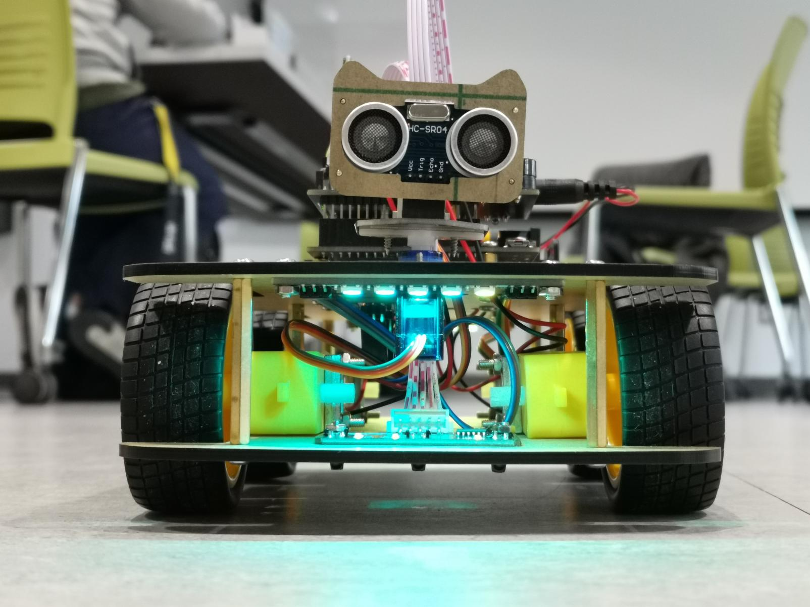

# Aardvark: The Autonomous Internet Pathfinder!

Embark on a journey with Aardvark, a cutting-edge autonomous robot engineered to hunt down the optimal WiFi connection in any environment.

## Thrilling Features
- Autonomous navigation through various environments
- Real-time internet connection quality polling
- Innate ability to seek out and move towards areas with the strongest connection

## Astounding Hardware
- Agile 4WD Arduino vehicle kit from Freenove
- Powerful Arduino Uno Wifi rev.2 board
- Precision ultrasonic sensor for obstacle detection

## Revolutionary Systems
- **WiFi System**: Evaluates internet connection, delivers signal strength data
- **Car System**: Seamlessly manages navigation and obstacle avoidance, communicates with the WiFi system and hardware controllers

## Future Enhancements
- User-notification system for connection updates
- Latency measurement for enhanced navigation
- Active WiFi seeking for more accurate location detection
- Voltage-compensation to ensure consistent performance
- Durable power supply for longer operational time
- Improved motor function for diverse terrains

## The Pioneers
- Chester Chung (c54chung)
- Jason Karapostolakis (jkarapos)
- Krish Parmar (k6parmar)
- Shenq Kang Tan (sk4tan)
- Olivia Yixin Ouyang (y38ouyan)

## References
- [Freenove 4WD Car Kit](https://github.com/Freenove/Freenove_4WD_Car_Kit)
- [Arduino Reference](https://www.arduino.cc/reference/en/)
- [Serial Communication Protocols](https://circuitdigest.com/tutorial/serial-communication-protocols)
- [Arduino Uno WiFi rev2](https://store.arduino.cc/products/arduino-uno-wifi-rev2)
